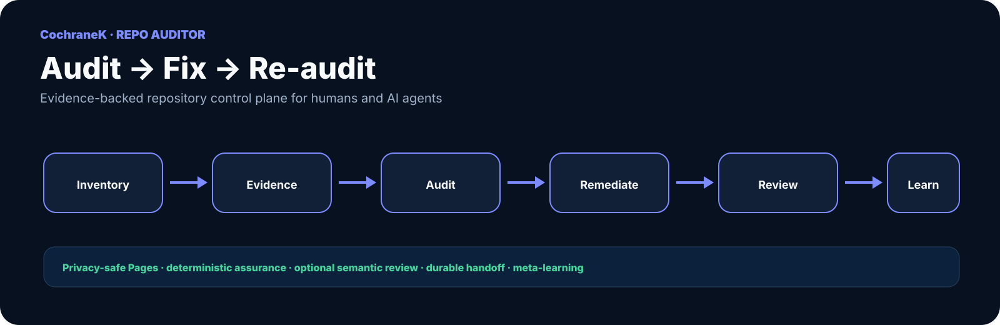
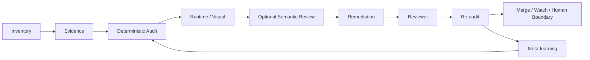
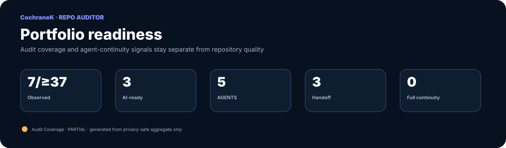

<p align="center">
  
</p>

# repo-auditor

**Evidence-backed Repository Audit + Remediation Agent · 审、改、再审。**

[工作台](https://cochranek.github.io/repo-auditor/) · [Progress](PROGRESS_REPORT.md) · [Portfolio](PORTFOLIO.md) · [Audit Rubric](AUDIT_RUBRIC.md) · [Architecture](docs/architecture.md) · [AI Semantic Review](AI_SEMANTIC_REVIEW.md)

## 定位

`repo-auditor` 是 CochraneK GitHub portfolio 的审计控制面。它不仅发现问题，还把安全、可逆的 finding 推进到修复、验证和再审。



GO mode 的目标闭环：

```text
Audit → classify → semantic review when useful → auto-fix safe findings → test → re-audit → merge
```

## Quick Start

先验证 repo-auditor 自身：

```bash
python -m py_compile scripts/*.py
python -m unittest discover -s tests -v
python scripts/visual_ux_audit.py docs/index.html --json --fail-on-findings
python scripts/audit_registry.py
```

采集单仓证据：

```bash
GITHUB_TOKEN=... \
python scripts/collect_repo_evidence.py CochraneK/repo-auditor \
  --out private-evidence/repo-auditor.json
```

检查 AI readiness：

```bash
python scripts/ai_readiness.py private-evidence/repo-auditor.json
```

## 审计层

- **L0 Inventory** — 仓库进入控制面。
- **L1 Evidence** — commit、CI、workflow、工程结构与治理证据。
- **L2 Deterministic triage** — 高置信、可重复的工程问题。
- **L3 Runtime / visual / structured audit** — 运行时与结构化报告。
- **L4 AI Semantic Review** — 项目目标、架构、产品/科研逻辑、UX、测试有效性与 deterministic auditor 漏项。
- **L5 Remediation** — 安全 finding 已修复、测试、再审。
- **L6 AI Readiness** — README、AGENTS、HANDOFF、STATUS、DECISIONS、architecture、validation path 与 README onboarding。
- **L7 Self-improving** — 人/AI 发现的可泛化漏项转成 rule、test、skill 或 routing policy。

完整成熟度定义见 [AUDIT_MATURITY.md](AUDIT_MATURITY.md)。

## Portfolio readiness

<p align="center">
  
</p>

The image is generated from the privacy-safe aggregate rather than hand-maintained counts. The detailed snapshot is in [PROGRESS_REPORT.md](PROGRESS_REPORT.md).

## AI-native handoff

重要仓库应尽量具备：

```text
README.md
AGENTS.md
HANDOFF.md
STATUS.md
DECISIONS.md
docs/architecture.md
```

它们不是形式文件，而是让不同 Agent 在不依赖聊天历史的情况下继续工作的 durable context。repo-auditor 会把缺失项纳入 AI-readiness finding。

## AI Semantic Review

`scripts/semantic_review.py` 使用统一 OpenAI-compatible transport，目前支持 provider preset：

- `deepseek`
- `glm`
- `freellmapi`
- `custom`

DeepSeek / GLM 的具体 model 名称不永久硬编码，调用时通过 `--model` 或 `AI_REVIEW_MODEL` 指定，以避免 provider alias 漂移。

详见 [AI_SEMANTIC_REVIEW.md](AI_SEMANTIC_REVIEW.md)。

## Public / Private 边界

Private evidence 只有在显式授权时采集：

```bash
GITHUB_TOKEN=... \
python scripts/collect_repo_evidence.py owner/private-repo \
  --allow-private \
  --out private-evidence/private-repo.json
```

`private-evidence/` 被 gitignore。

对于 AI review：

```text
Public evidence  → approved external/local provider
Private evidence → local provider by default
Private evidence → external provider only with explicit authorization
```

Public Pages 只允许公开仓库详情和 privacy-safe aggregates。Private 仓库名称、URL、SHA、备注、代码证据和 findings 不进入 Pages。

## Coverage baseline

Account-wide coverage no longer depends on a stale hard-coded repository total. The canonical privacy-safe baseline is [`portfolio/coverage-baseline.json`](portfolio/coverage-baseline.json).

A **lower-bound** baseline can prove incompleteness but can never produce a full coverage PASS. An exact baseline requires explicitly verified complete owner visibility. See [Audit Coverage Baseline Standard](docs/standards/AUDIT_COVERAGE_BASELINE.md).

## Portfolio AI-native migration

```bash
python scripts/ai_native_migration_plan.py \
  private-evidence/portfolio-scan.json \
  --out private-evidence/ai-native-migration-plan.json
```

Detailed migration plans stay private when Private repository identifiers are present. See [AI-native Migration Standard](docs/standards/AI_NATIVE_MIGRATION.md).

## Audit Coverage ≠ CI status

这几类状态必须分开：

- **Engineering CI** — repo-auditor 自己是否通过测试。
- **Audit Coverage** — 当前凭据实际覆盖多少账户仓库。
- **Quality** — 工程质量的独立维度。
- **Priority** — 是否值得现在投入。
- **AI Readiness** — 下一位 Agent 能否可靠接手。
- **Semantic Review** — 是否完成上下文感知 L4 审查。

因此，CI 可以绿色而 Audit Coverage 仍为 `PARTIAL / external-blocked`。

## Branch governance

核心原则：

```text
workflow exists ≠ merge gate enforced
```

默认分支若 `protected=false`，即使 CI 当前全绿，也只能说明当前运行成功，不代表 merge gate 被强制执行。权限不足时必须记录为 `external-blocked`，不能把 unknown 写成 pass。

## Visual & UX audit

```bash
python scripts/visual_ux_audit.py docs/index.html --json --fail-on-findings
```

当前 deterministic 层负责高置信静态规则。多 viewport、运行时 overflow measurement 与 screenshot/AI visual review 属于更高层能力，不应混称为已完成。

## Structured audits

```text
audits/<repo>-YYYY-MM-DD.md
audits/<repo>-YYYY-MM-DD.json
```

```bash
python scripts/audit_reports.py
python scripts/remediation_queue.py
python scripts/audit_freshness.py
```

## GO 边界

安全、可逆、低风险 finding 可以自动整改并重审。

以下保持 owner-choice / human boundary：

- LICENSE / IP / visibility
- delete / archive
- destructive history rewrite
- confidential or patent-sensitive publication
- material external cost
- high-impact permission/admin changes without prior authorization

完整边界见 [AGENTS.md](AGENTS.md)、[POLICY.md](POLICY.md) 和 [DECISIONS.md](DECISIONS.md)。

## Pages

Portfolio Command Center: https://cochranek.github.io/repo-auditor/

源码在 `docs/`。Public Pages 是展示层，不是 private control plane。

## Public showcases

`repo-auditor` can act as a public static showcase while source repositories remain Private. Reviewed artifacts are mirrored under `docs/showcase/`; the publication allowlist lives in `docs/showcase/manifest.json`.

The showcase layer is intentionally separate from the audit registry. It may publish a project display name and the minimum static assets required for a reviewed demo, but it does not publish Private repository URLs, Git SHAs, internal findings/notes, credentials, real user/research data, admin surfaces, or unreviewed IP.

When Pages is enabled, open `/showcase/` from the main audit terminal.
