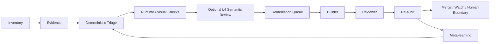
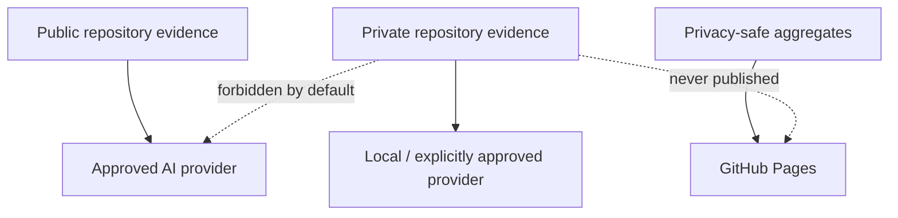

# Architecture

```mermaid
flowchart LR
  A[Inventory] --> B[Evidence]
  B --> C[Deterministic Triage]
  C --> D[Runtime / Visual Checks]
  D --> E[Optional L4 Semantic Review]
  E --> F[Remediation Queue]
  F --> G[Builder]
  G --> H[Reviewer]
  H --> I[Re-audit]
  I --> J[Merge / Watch / Human Boundary]
  I --> K[Meta-learning]
  K --> C
```

## Trust boundaries

```mermaid
flowchart TB
  P[Public repository evidence] --> R[Approved AI provider]
  X[Private repository evidence] --> L[Local / explicitly approved provider]
  X -. forbidden by default .-> R
  S[Privacy-safe aggregates] --> G[GitHub Pages]
  X -. never published .-> G
```

The architecture keeps deterministic assurance, semantic judgment, remediation authority and publication boundaries separate.
