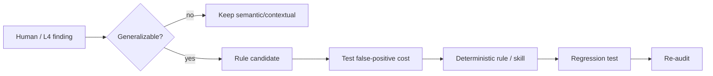

# Meta-learning loop

repo-auditor should get better when humans or L4 reviewers find a repeatable class of miss.



## Candidate pipeline

`scripts/meta_learning.py` extracts `regression_candidates` from an L4 semantic report, normalizes and deduplicates them, and keeps them in **candidate** state.

A candidate is not a rule merely because a model suggested it.

Public-registry write is allowed only when the source is explicitly declared public:

```bash
python scripts/meta_learning.py semantic-review.json \
  --source-visibility public \
  --write-public-registry
```

For private evidence, write only to a private/gitignored location:

```bash
python scripts/meta_learning.py private-evidence/review.json \
  --source-visibility private \
  --out private-evidence/meta-candidates.json
```

The CLI refuses to publish candidates declared as derived from private evidence.

## Promotion gate

Before promoting a candidate into a deterministic check:

1. reproduce the problem on at least one real case;
2. define evidence that can be collected reliably;
3. estimate false-positive/false-negative cost;
4. add fixtures/tests;
5. document remediation class and owner-choice boundary;
6. dogfood it on repo-auditor.

This keeps L7 self-improvement evidence-backed instead of turning model opinions into policy.
